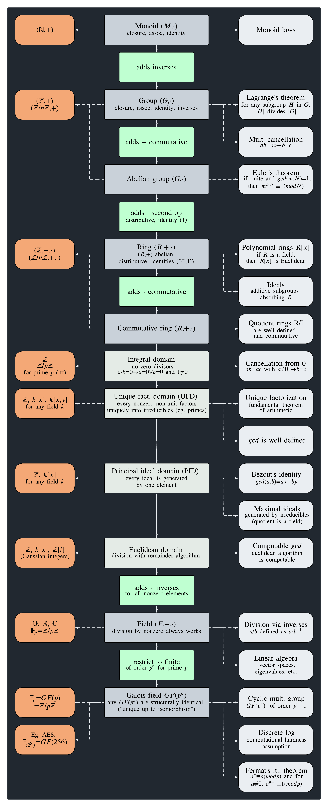

# Algebra & Cryptography

A collection of [Lean 4](https://lean-lang.org/) files written as a personal study of modern algebra and its applications to cryptography. Built on top of [Mathlib](https://github.com/leanprover-community/mathlib4).

> **Status:** heavily work in progress. Expect gaps, rough edges, and frequent rewrites; files will be added, restructured, and refined over time as the study progresses.

## Layout

- [Algebra](Algebra/): core algebraic structures
  - [Group](Algebra/Group/)
    - [Cyclic](Algebra/Group/Cyclic.lean): cyclic groups and their connection to ℤ/nℤ
  - [Ring](Algebra/Ring/)
    - [Polynomials](Algebra/Ring/Polynomials.lean): polynomial rings, working over 𝔽₃[X]
    - [Ideals](Algebra/Ring/Ideals.lean): ideals, kernels, quotients, and the prime/maximal hierarchy
  - [Field](Algebra/Field/)
    - [Galois](Algebra/Field/Galois.lean): finite fields GF(pⁿ) and their structure
- [Crypto](Crypto/): cryptographic schemes built on the above
  - [DiffieHellman](Crypto/DiffieHellman.lean): key exchange in a cyclic group
  - [Rsa](Crypto/Rsa.lean): RSA correctness from Bézout and Euler's theorem
  - [EllipticCurves](Crypto/EllipticCurves.lean): Weierstrass curves over finite fields

## Build

```sh
lake build
```

The Mathlib revision is pinned in [lakefile.toml](lakefile.toml).


