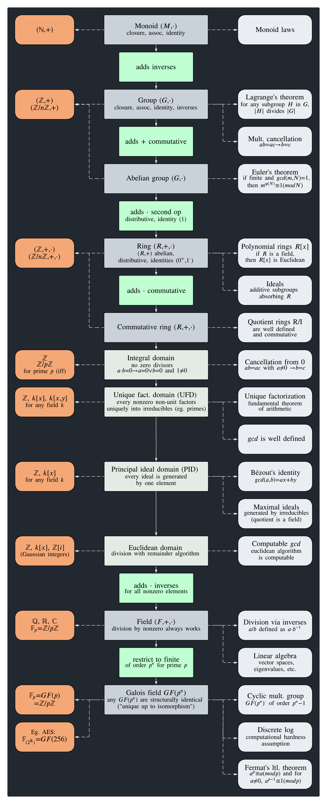

# Algebra & Cryptography

A collection of [Lean 4](https://lean-lang.org/) files written as a personal study of modern algebra and its applications to cryptography. Built on top of [Mathlib](https://github.com/leanprover-community/mathlib4).

> **Status:** heavily work in progress. Expect gaps, rough edges, and frequent rewrites; files will be added, restructured, and refined over time as the study progresses.

## Layout

- [Algebra](Algebra/): core algebraic structures
  - [Code](Algebra/Code/)
    - [Hamming](Algebra/Code/Hamming.lean): the [7,4,3] Hamming code; generator and parity-check matrices, codewords, syndrome decoding, single-error correction, and a worked example
    - [Multiplicity](Algebra/Code/Multiplicity.lean): multiplicity vanishing for binary multilinear polynomials, hold-out test (Ghoshal–Ishai–Jain–Sun), and a demonstration on a small structured vs random matrix
    - [Hypergraph](Algebra/Code/Hypergraph.lean): hypergraph incidence matrix as a parity-check matrix, k-uniformity, minimum distance, unique syndrome decoding theorem, and the Hamming [7,4,3] code as a 4-uniform hypergraph
  - [Group](Algebra/Group/)
    - [Cyclic](Algebra/Group/Cyclic.lean): cyclic groups and their connection to ℤ/nℤ
  - [Ring](Algebra/Ring/)
    - [Polynomials](Algebra/Ring/Polynomials.lean): polynomial rings, working over 𝔽₃[X]
    - [RootsInterpolation](Algebra/Ring/RootsInterpolation.lean): the roots bound (Schwartz–Zippel), interpolation, and vanishing polynomials
    - [Ideals](Algebra/Ring/Ideals.lean): ideals, kernels, quotients, and the prime/maximal hierarchy
  - [Field](Algebra/Field/)
    - [Galois](Algebra/Field/Galois.lean): finite fields GF(pⁿ) and their structure
    - [QuadraticResidues](Algebra/Field/QuadraticResidues.lean): squares in 𝔽ₚ, Euler's criterion, and the Legendre symbol
    - [RootsOfUnity](Algebra/Field/RootsOfUnity.lean): roots of unity in finite fields, primitive roots, and the connection to cyclic subgroups
- [Crypto](Crypto/): cryptographic schemes built on the above
  - [DiffieHellman](Crypto/DiffieHellman.lean): key exchange in a cyclic group
  - [Rsa](Crypto/Rsa.lean): RSA correctness from Bézout and Euler's theorem
  - [EllipticCurves](Crypto/EllipticCurves.lean): Weierstrass curves over finite fields
  - [Paillier](Crypto/Paillier.lean): additively homomorphic encryption, decryption correctness proven as algebra
  - [McEliece](Crypto/McEliece.lean): code-based encryption; scrambling by S·G·P, decryption correctness from a decoder hypothesis, and a fully executable [7,4,3] Hamming code instance
  - [ZK](Crypto/ZK/)
    - [Schnorr](Crypto/ZK/Schnorr.lean): sigma protocol for knowledge of a discrete log; completeness, special soundness, and honest-verifier zero-knowledge

## Build

```sh
lake build
```

The Mathlib revision is pinned in [lakefile.toml](lakefile.toml).


